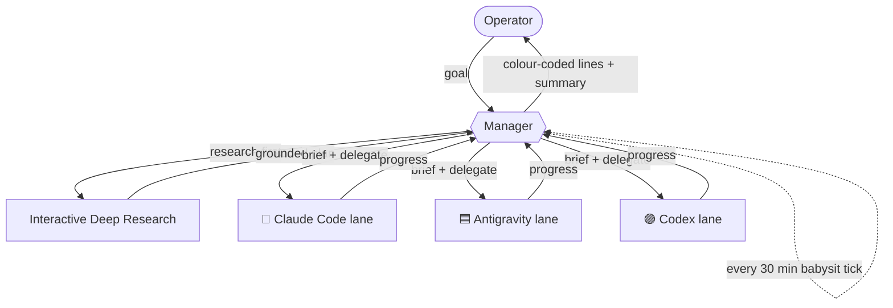
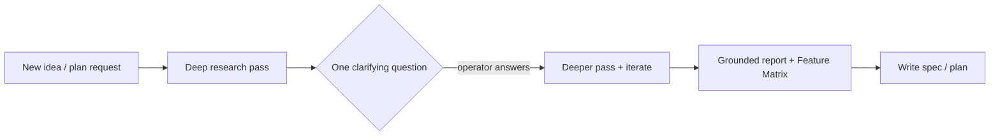

# 🧭 Martin's Agent Manager

A tiny **manager / orchestrator** discipline for running a fleet of coding agents
(**Claude Code**, **Antigravity**, **Codex**) as watchable terminal sub-sessions.

The manager is a *thin orchestrator*: it **never does the work itself** and
**never thinks/plans itself** — it delegates *all* non-trivial reasoning to worker
lanes, **researches before planning**, **babysits** on a timer, and **reports back
in one fixed, colour-coded format** that's easy to scan (built for a dyslexic
operator: calm, line-based, emoji-keyed, no noisy ASCII boxes).

> This repo is the **public, anonymised** version of the convention. It contains no
> hostnames, secrets, or private project names — just the reusable pattern.

---

## 🤖 Engine legend (icons + colours)

Every worker sub-session is named with its engine's icon + colour, so you instantly
see *who* is running.

- 🦀 **Claude Code** — 🟧 orange — priority HIGH 🔺 — `🦀 cc·frontend`
- 🟦 **Antigravity / agy** — blue (square icon) — light tasks 🔹, limit irrelevant — `🟦 agy·mock`
- 🟣 **Codex** — lila (circle) — mid priority 🔸 — `🟣 codex·tests`

Watch/guard sessions stay neutral (grey).

**Subagent = Antigravity by default** (esp. light tasks like IDR). Pick model first:
Flash = light; Gemini 3.1 Pro High = harder. Important → CC; light → agy. Empty
context → CC + Sonnet. agy limit irrelevant. If unsure which engine, ask the operator.

---

## 📋 Report format — Variant A: sectioned report

The manager reports in **STATUS SECTIONS** — **no Markdown table** (renders buggy in
CMUX) and no ASCII/box frames. Each section has a header emoji, slim indented lines,
progress bar, and a confidence word. Questions are restated at the END with answers
in [square brackets].

```
✅ ERLEDIGT
  <engine-icon> Thema       ██████████ 100%
🔄 LÄUFT
  <engine-icon> Thema       ██░░░░░░░░  20%   🔎 prüfen
👀 BITTE DRÜBERSCHAUEN
  <engine-icon> Thema       ███░░░░░░░  30%   🔎 unsicher
🚨 ALARM            (nur wenn kritisch)
  <engine-icon> Thema — was sofort zu tun ist

❓ FRAGEN
  Q1  <frage>
      [1] … ⭐   [2] …   [3] …
```

- **Sections (in order):** ✅ ERLEDIGT · 🔄 LÄUFT · 👀 BITTE DRÜBERSCHAUEN ·
  🚨 ALARM (only when truly critical, outranks all) · ❓ FRAGEN
- **Progress:** bar + percent `██████░░░░ 60%` (10-block Unicode bars)
- **Confidence word** (after bar): `sicher` · `prüfen` · `unsicher`
- **Questions** restated at the END in ❓ FRAGEN; answers in `[square brackets]`
  with `[1] … ⭐` on the recommended option. Running numbers never restart across
  questions. Operator replies with just the number(s), e.g. `1 3`.
- Engine icons: 🦀 cc-orange · 🟦 agy-blue · 🟣 codex-purple. Priority optional.
  Drop nonsensical "continue?" rows.

### Example

```
✅ ERLEDIGT
  🦀 Frontend lane       ██████████ 100%
  🟦 Mock lane           ██████████ 100%

🔄 LÄUFT
  🟣 Tests lane          ██████░░░░  60%   🔎 prüfen

👀 BITTE DRÜBERSCHAUEN
  🧹 Dirty worktree      ████░░░░░░  40%   🔎 unsicher

🚨 ALARM
  💥 Auth broken — tokens expired, all lanes blocked — fix immediately

❓ FRAGEN
  Q1  Deploy target?
      [1] managed ⭐   [2] self-host
  Q2  Scope?
      [3] optional module now ⭐   [4] later
```

---

## 🔒 Hard rule: manager only



The manager may: spawn/brief worker lanes, schedule ticks, write memory, synthesise
reports, ask clarifying questions.

The manager may **not**: edit files, run builds/tests/installs, call task-doing
APIs, or implement. Everything that *does* the task goes to a worker lane in a
watchable session.

### Never think/plan yourself — delegate by default

The manager **never reasons out plans, research, or project-logic itself**. Any
non-trivial thinking is **spawned as a worker agent** (default: 🟦 Antigravity +
interactive deep research) that reports back a **concise result**, so the manager's
context stays clean and cheap. The manager only briefs, schedules, and synthesises.

**Default execution target = the remote worker host**, never the local machine —
unless the task strictly needs local hardware (e.g. an iOS build).

---

## 🔬 Research-first

Before planning anything new, **research first** to ground the plan — *before*
specs/architecture/code.



**Comparisons MUST produce a Feature Matrix** — one row per program, columns for the
deciding criteria, and a **GitHub link per program**. Example shape:

| Tool | Language | License | Key capability | GitHub |
|---|---|---|---|---|
| Tool A | Rust | MIT | … | `github.com/org/tool-a` |
| Tool B | Go | Apache-2.0 | … | `github.com/org/tool-b` |

---

## 📦 What's here

- `skills/agent-manager/SKILL.md` — the reusable skill (drop into `~/.claude/skills/`).
- `CLAUDE.md` — an anonymised excerpt of the global rules (report format + engine
  legend + research-first).

## License

MIT — see [LICENSE](LICENSE).
