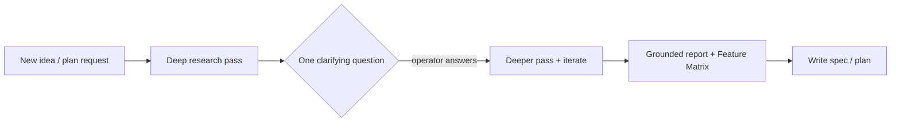

# 🧭 Martin's Agent Manager

A tiny **manager / orchestrator** discipline for running a fleet of coding agents
(**Claude Code**, **Antigravity**, **Codex**) as watchable terminal sub-sessions.

The manager is a *thin orchestrator*: it **never does the work itself** and
**never thinks/plans itself** — it delegates *all* non-trivial reasoning to worker
lanes, **researches before planning**, **babysits** on a timer, and **reports back
in one fixed, colour-coded format** that's easy to scan (built for a dyslexic
operator: calm, line-based, emoji-keyed, no noisy ASCII boxes).

> This repo is the **public, anonymised** version of the convention. It contains no
> hostnames, secrets, or private project names — just the reusable pattern.

---

## 🤖 Engine legend (icons + colours)

Every worker sub-session is named with its engine's icon + colour, so you instantly
see *who* is running.

- 🦀 **Claude Code** — 🟧 orange — priority HIGH 🔺 — `🦀 cc·frontend`
- 🟦 **Antigravity / agy** — blue (square icon) — light tasks 🔹, limit irrelevant — `🟦 agy·mock`
- 🟣 **Codex** — lila (circle) — mid priority 🔸 — `🟣 codex·tests`

Watch/guard sessions stay neutral (grey).

**Subagent Selection**:
- **Cheap/unlimited model**: Gemini 3.x Pro (High) via Antigravity (operator's "agy limit irrelevant" applies here).
- **Metered/expensive model**: Claude (Sonnet/Opus) via Antigravity or Claude Code.
- Important work -> Antigravity + Gemini 3.1 Pro (High) (immune to VM auto-reapers and settings prompts). Reserve Claude Code or agy-Claude-models for rare, critical tasks.
- Empty context -> Claude Code with Sonnet.
- If unsure, ask the operator.

---

## 📋 Report format — Variant A: sectioned report

The manager reports in **STATUS SECTIONS** — **no Markdown table** (renders buggy in
CMUX) and no ASCII/box frames. Each section has a header emoji, slim indented lines,
progress bar, and a confidence word. Questions are restated at the END with answers
in [square brackets].

```
✅ ERLEDIGT
  <engine-icon> **Thema**       ██████████ 100%
🔄 LÄUFT
  <engine-icon> **Thema**       ██░░░░░░░░  20%   🔎 prüfen
      🧠 IDR 🔁2  🕐 1h ago   🔬 DR 🟢 ⚡ running [🛰]
👀 BITTE DRÜBERSCHAUEN
  <engine-icon> **Thema**       ███░░░░░░░  30%   🔎 unsicher
🚨 ALARM            (critical only)
  <engine-icon> **Thema** — what to do right now

❓ FRAGEN
  Q1  <question>
      [1] … ⭐   [2] …   [3] …
```

- **Sections (in order):** ✅ ERLEDIGT · 🔄 LÄUFT · 👀 BITTE DRÜBERSCHAUEN ·
  🚨 ALARM (only when truly critical, outranks all) · ❓ FRAGEN
- **Progress:** bar + percent `██████░░░░ 60%` (10-block Unicode bars)
- **Confidence word** (after bar): `sicher` · `prüfen` · `unsicher`
- **Bold** (`**…**`): important lane names / themes and key numbers so the operator
  can scan fast.
- **Colour:** chat reports use emoji + **bold** (Markdown); heartbeat TUI uses ANSI colours.
- **Research indicator line** (indented line under the lane, when relevant):
  `🔬` = Deep Research · `🧠` = IDR (interactive deep research) ·
  `🔁 N` = iteration count · `🕐 <when>` = last run · `⚡` = running RIGHT NOW.
  **Time is always RELATIVE** ("1h ago", "30min ago", "24h ago") — **never a date**.
  **Research status as a traffic light:** 🟢 done · 🟠 in progress · 🔴 error/blocked.
- **Location-Icons** indicate execution environment:
  - `🛰` = remote VM / server lanes
  - `💻` = Mac-local lanes
  Example: `      🧠 IDR 🟢 🔁3  🕐 2h ago   🔬 DR 🟠 ⚡ running [🛰]`
- **Questions** restated at the END in ❓ FRAGEN; answers in `[square brackets]`
  with `[1] … ⭐` on the recommended option. Running numbers never restart across
  questions. Operator replies with just the number(s), e.g. `1 3`.
- Engine icons: 🦀 cc-orange · 🟦 agy-blue · 🟣 codex-purple. Priority optional.
  Drop nonsensical "continue?" rows.
- Short `📋 Summary:` after a `───` divider at the end.

### Example

```
✅ ERLEDIGT
  🦀 **Frontend lane**    ██████████ 100%
  🟦 **Mock lane**        ██████████ 100%

🔄 LÄUFT
  🟣 **Tests lane**       ██████░░░░  60%   🔎 prüfen [🛰]
      🧠 IDR 🟢 🔁1  🕐 30min ago

👀 BITTE DRÜBERSCHAUEN
  🧹 **Dirty worktree**   ████░░░░░░  40%   🔎 unsicher [💻]

🚨 ALARM
  💥 **Auth broken** — tokens expired, all lanes blocked — fix immediately

❓ FRAGEN
  Q1  Deploy target?
      [1] managed ⭐   [2] self-host
  Q2  Scope?
      [3] optional module now ⭐   [4] later

───
📋 Summary: 2 done, 1 running (tests 60%), 1 needs review, 1 alarm. Auth must be fixed before deploy.
```

---

## 🔒 Hard rule: manager only


The manager may: spawn/brief worker lanes, schedule ticks, write memory, synthesise
reports, ask clarifying questions.

The manager may **not**: edit files, run builds/tests/installs, call task-doing
APIs, or implement. Everything that *does* the task goes to a worker lane in a
watchable session.

### Never think/plan yourself — delegate by default

The manager **never reasons out plans, research, or project-logic itself**. Any
non-trivial thinking is **spawned as a worker agent** (default: 🟦 Antigravity +
interactive deep research) that reports back a **concise result**, so the manager's
context stays clean and cheap. The manager only briefs, schedules, and synthesises.

- **Remote VM Tasks**: Delegated to sub-agents or tmux/CMUX sessions running on the remote VM.
- **Mac-Local Tasks**: Spawns a local CMUX sub-session (e.g. `cmux workspace create --command "agy ..."`), rather than running it inside the manager's own shell directly.
- **Default execution target = the remote VM**, never the local machine — unless the task strictly needs local hardware (e.g. an iOS build).

---

## 💡 Strategic token-aware orchestration

At every heartbeat the manager makes a **strategic orchestration decision** based on
(a) each lane's **priority** and (b) each provider's **remaining token budget**
(CodexBar-style: weekly / daily / session for Claude Code / Codex / Antigravity).

**Token-Value Mindset:**
- Cheap/unlimited tokens (Antigravity Gemini models) -> **use as much as possible**. Spin up more cheap lanes to keep capacity full. **Burn surplus usage before a quota reset.**
- Metered tokens (Claude Code, Codex, agy-Claude-models) -> **conserve carefully**. Save for critical core tasks.
- For simple, low-logic research, prefer **free OSS harnesses/models** (e.g. OpenCode + free models, OpenRouter free tier, GitHub Copilot credits) over metered tokens.
- **Status check queries**: Do NOT burn expensive tokens on checking lane status; route status inquiries to NotebookLM/IDR instead (cheap).
- Staging/Stopping: Stop or deprioritise low-priority lanes to allocate tokens to high-priority tasks. Surface these decisions in the report.

Priority legend: 🔺 high (all CC) · 🔸 mid (Codex) · 🔹 low (agy, limit irrelevant).

---

## 🔬 Research-first & NotebookLM

Before planning anything new, **research first** to ground the plan — *before*
specs/architecture/code.
Any time a task is the *initial* step of a new project, feature, or plan request, IDR must fire first using the canonical NotebookLM notebooks (configured via the project's `.notebooklm/manifest.json` and saved in `<repo>/.notebooklm/`). Never start duplicate notebooks.



**Comparisons MUST produce a Feature Matrix** — one row per program, columns for the
deciding criteria, and a **GitHub link per program**. Example shape:

| Tool | Language | License | Key capability | GitHub |
|---|---|---|---|---|
| Tool A | Rust | MIT | … | `github.com/org/tool-a` |
| Tool B | Go | Apache-2.0 | … | `github.com/org/tool-b` |

---

## 🕵️‍♂️ Beweis-Pflicht & Quality-Gate (Quality Gate Rule)

When a lane reports "done" or the operator requests "beweise ...", the task is not finished. You must perform **1–2 extra verification rounds**:
1. **Screenshots Required**: For UI, frontends, or E2E results, proof MUST be visual (screenshots).
2. **Ablage**: Save screenshots in a `.proof/` folder in the repository. Filename must be **dated + descriptive** (e.g., `.proof/YYYY-MM-DD_feature-name.png`). Commit these to the repo.
3. **Quality-Gate Agent**: Spawn a separate **Antigravity Quality-Gate lane** to review the proofs critically:
   - Does it show **real data, not mock data/placeholders**?
   - Check against the real backend / database. Demand file:line code traces.
   - For revenue-facing or production products: **NEVER use mock/fake data or fallbacks**. If real data is blocked, report as blocked.
4. **Done** only counts when the Quality-Gate confirms a `CONFIRMED` status (not `REFUTED`). Highlight proof status as:
   - 🟢 verified
   - 🟠 self-report only
   - 🔴 mock-suspected

---

## 📋 Plannotator & long plans

- **Lange Pläne**: Complex plans must automatically run through a **Plannotator pass** (generating Mermaid workflow/sequence diagrams, emojis, step-by-step checkboxes) before execution.

---

## 💻 local cmux controls (`skills/cmux-control/`)

- Use `cmux` CLI commands locally to display rendered previews (markdown, URLs, websites, logs) in a dedicated right-side `📄 preview` workspace instead of pasting large blocks of text.
- Follow the clean naming and coloring conventions for workspaces.
- Supports Dock configurations and Custom SwiftUI Sidebars.

---

## 📦 What's here

- `skills/agent-manager/SKILL.md` — the reusable skill for multi-agent manager orchestration.
- `skills/cmux-control/SKILL.md` — local macOS workspace control and previews.
- `CLAUDE.md` — anonymised user-global rules (reporting format, engine roster, research).

## License

MIT — see [LICENSE](LICENSE).
