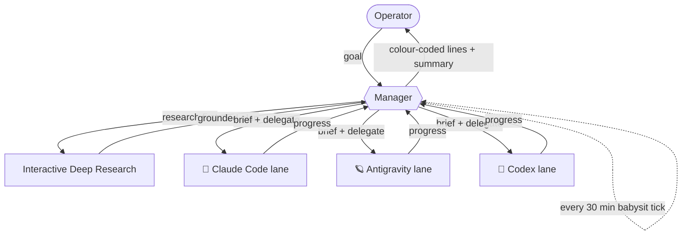
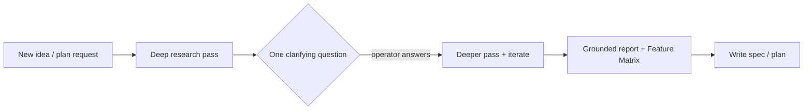

# 🧭 Martin's Agent Manager

A tiny **manager / orchestrator** discipline for running a fleet of coding agents
(**Claude Code**, **Antigravity**, **Codex**) as watchable terminal sub-sessions.

The manager is a *thin orchestrator*: it **never does the work itself** and
**never thinks/plans itself** — it delegates *all* non-trivial reasoning to worker
lanes, **researches before planning**, **babysits** on a timer, and **reports back
in one fixed, colour-coded format** that's easy to scan (built for a dyslexic
operator: calm, line-based, emoji-keyed, no noisy ASCII boxes).

> This repo is the **public, anonymised** version of the convention. It contains no
> hostnames, secrets, or private project names — just the reusable pattern.

---

## 🤖 Engine legend (icons + colours)

Every worker sub-session is named with its engine's icon + colour, so you instantly
see *who* is running.

- 🦀 **Claude Code** — 🟧 orange — `🦀 cc·frontend`
- 🪐 **Antigravity** — 🟦 blue — `🪐 agy·mock`
- 📜 **Codex** — 🟪 lila (purple) — `📜 codex·tests`

Watch/guard sessions stay neutral (grey).

---

## 📋 Report format

The manager reports as **one line per item** — **no Markdown table** (it renders
buggy in CMUX) and no ASCII/box frames. Rows ordered **top → bottom** so the thing
you must act on sits right above the prompt:

1. 🟢 **Green** (top) — already done / on-track
2. 🟡 **Yellow** (middle) — future risks / watch-outs
3. 🔴 **Red** (bottom) — **questions/decisions you must answer**

Each line: `<🟢/🟡/🔴> <bar> <pct>  <topic-emoji> Topic — short detail`. Progress is
always a bar + percent, e.g. `▓▓▓▓░░░░░░ 40%` (or `3/8`).

**Numbered questions:** every selectable option across *all* 🔴 rows gets ONE unique
running number — never restart at 1 per question. Mark the recommendation with ⭐.
The operator replies with just the number(s), e.g. `1 3`.

**Summary always at the end, clearly visible** — a short divider line, then bold
`📋 Summary:` + 1–3 lines (no `✦` emoji rows, no box).

### Anonymised example

```
🟢 ▓▓▓▓▓▓▓▓▓▓ 100%  🦀 Frontend lane — Spec #1 rendered + E2E green ✅
🟢 ▓▓▓▓▓▓▓▓▓▓ 100%  🪐 Mock lane — mock server scaffolded, README written 📄
🟡 ▓▓▓▓▓▓░░░░ 60%   🧹 Dirty worktree — 40 uncommitted files → commit before next spec ⚠️
🟡 ▓▓▓░░░░░░░ 30%   🔧 Tooling unverified — self-test running; self-heals on failure
🔴 ░░░░░░░░░░ 0%    🚀 Deploy target — 1) managed ⭐  2) self-host?
🔴 ░░░░░░░░░░ 0%    📦 Scope — 3) optional module now ⭐  4) later?

───────────
📋 Summary: 2 lanes building feature X (done); self-test healthy.
🔴 Open: deploy target + scope — reply with the numbers.
```

---

## 🔒 Hard rule: manager only



The manager may: spawn/brief worker lanes, schedule ticks, write memory, synthesise
reports, ask clarifying questions.

The manager may **not**: edit files, run builds/tests/installs, call task-doing
APIs, or implement. Everything that *does* the task goes to a worker lane in a
watchable session.

### Never think/plan yourself — delegate by default

The manager **never reasons out plans, research, or project-logic itself**. Any
non-trivial thinking is **spawned as a worker agent** (default: 🪐 Antigravity +
interactive deep research) that reports back a **concise result**, so the manager's
context stays clean and cheap. The manager only briefs, schedules, and synthesises.

**Default execution target = the remote worker host**, never the local machine —
unless the task strictly needs local hardware (e.g. an iOS build).

---

## 🔬 Research-first

Before planning anything new, **research first** to ground the plan — *before*
specs/architecture/code.



**Comparisons MUST produce a Feature Matrix** — one row per program, columns for the
deciding criteria, and a **GitHub link per program**. Example shape:

| Tool | Language | License | Key capability | GitHub |
|---|---|---|---|---|
| Tool A | Rust | MIT | … | `github.com/org/tool-a` |
| Tool B | Go | Apache-2.0 | … | `github.com/org/tool-b` |

---

## 📦 What's here

- `skills/agent-manager/SKILL.md` — the reusable skill (drop into `~/.claude/skills/`).
- `CLAUDE.md` — an anonymised excerpt of the global rules (report format + engine
  legend + research-first).

## License

MIT — see [LICENSE](LICENSE).
