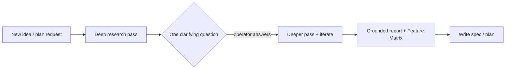

# 🧭 Martin's Agent Manager

A tiny **manager / orchestrator** discipline for running a fleet of coding agents
(**Claude Code**, **Antigravity**, **Codex**) as watchable terminal sub-sessions.

The manager is a *thin orchestrator*: it **never does the work itself** — it
delegates to worker lanes, **researches before planning**, **babysits** on a timer,
and **reports back in one fixed, colour-coded format** that's easy to scan (built
for a dyslexic operator: calm, tabular, emoji-keyed, no noisy ASCII boxes).

> This repo is the **public, anonymised** version of the convention. It contains no
> hostnames, secrets, or private project names — just the reusable pattern.

---

## 🤖 Engine legend (icons + colours)

Every worker sub-session is named with its engine's icon + colour, so you instantly
see *who* is running.

| Engine | Emoji | Colour | Session name example |
|---|---|---|---|
| Claude Code | 🦀 | 🟧 orange | `🦀 cc·frontend` |
| Antigravity | 🪐 | 🟪 purple | `🪐 agy·mock` |
| Codex | 📜 | 🟩 green | `📜 codex·tests` |

Watch/guard sessions stay neutral (grey).

---

## 📋 Report format

The manager reports as **one Markdown table**, rows ordered **top → bottom** so the
thing you must act on sits right above the prompt:

1. 🟢 **Green** (top) — already done
2. 🟡 **Yellow** (middle) — future risks / watch-outs
3. 🔴 **Red** (bottom) — **questions/decisions you must answer**

Then a short **summary** fenced by an **emoji row above and below** — never a box
frame (boxes render badly in a terminal).

### Anonymised example

| Status | Topic | Detail / next step |
|---|---|---|
| 🟢 | 🦀 Frontend lane | Spec #1 rendered + E2E green ✅ |
| 🟢 | 🪐 Mock lane | Mock server scaffolded, README written 📄 |
| 🟡 | Dirty worktree | 40 uncommitted files → commit before next spec ⚠️ |
| 🟡 | Tooling unverified | Self-test running; self-heals on failure 🔧 |
| 🔴 | Deploy target | Option **A** (managed) or **B** (self-host)? ❓ |
| 🔴 | Scope | Include the optional module now or later? ❓ |

✦ ✦ ✦ ✦ ✦  📋 SUMMARY  ✦ ✦ ✦ ✦ ✦
2 lanes building feature X; self-test healthy. 🔴 Only the deploy target is open.
✦ ✦ ✦ ✦ ✦ ✦ ✦ ✦ ✦ ✦ ✦ ✦ ✦ ✦

---

## 🔒 Hard rule: manager only

The manager may: spawn/brief worker lanes, schedule ticks, write memory, synthesise
reports, ask clarifying questions.

The manager may **not**: edit files, run builds/tests/installs, call task-doing
APIs, or implement. Everything that *does* the task goes to a worker lane in a
watchable session.

---

## 🔬 Research-first

Before planning anything new, **research first** to ground the plan — *before*
specs/architecture/code.

**Comparisons MUST produce a Feature Matrix** — one row per program, columns for the
deciding criteria, and a **GitHub link per program**. Example shape:

| Tool | Language | License | Key capability | GitHub |
|---|---|---|---|---|
| Tool A | Rust | MIT | … | `github.com/org/tool-a` |
| Tool B | Go | Apache-2.0 | … | `github.com/org/tool-b` |

---

## 📦 What's here

- `skills/agent-manager/SKILL.md` — the reusable skill (drop into `~/.claude/skills/`).
- `CLAUDE.md` — an anonymised excerpt of the global rules (report format + engine
  legend + research-first).

## License

MIT — see [LICENSE](LICENSE).
